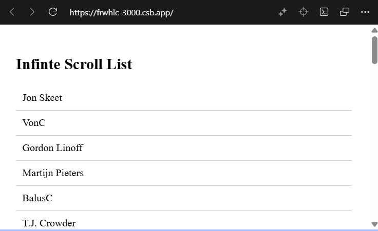

# 📜 Infinite Scroll App

A React-based infinite scrolling demo that fetches paginated user data from the Stack Exchange API using `axios` and `IntersectionObserver`. As the user scrolls, more data is loaded seamlessly—perfect for building performant, user-friendly interfaces.

---

## 🚀 Features

- 🔄 Infinite scroll using `IntersectionObserver`
- 🌐 Public API integration with Stack Exchange
- ⚡ Axios for clean and efficient HTTP requests
- 🧠 Functional React with hooks (`useState`, `useEffect`, `useCallback`)
- 🧹 Clean separation of concerns with modular components

---

## 📦 Installation

```bash
git clone https://github.com/your-username/infinite-scroll-app.git
cd infinite-scroll-app
npm install
npm start
```

---

# 🧩 Project Structure

```bash
infinite-scroll-app/
├── src/
│ ├── App.jsx # Entry point
│ ├── InfiniteScrollList.jsx # Core infinite scroll component
│ └── api.js # Axios API wrapper
├── public/
│ └── index.html
├── package.json
└── README.md
```

---

## 🔧 API Used

### Stack Exchange Users API

GET https://api.stackexchange.com/2.3/users?page=1&pagesize=20&order=desc&sort=reputation&site=stackoverflow

## Sample Response:

### Json

{
"items": [
{ "display_name": "Jon Skeet", "user_id": 22656, ... }
],
"has_more": true
}

## 🧪 How It Works

- A sentinel <div ref={loaderRef} /> is placed at the bottom of the list.
- When it enters the viewport, IntersectionObserver triggers loadMore().
- loadMore() fetches the next page via Axios and appends it to the list.
- The has_more flag from the API prevents unnecessary calls.

## 📸 Screenshot



# 🛠️ Customization

- 🔍 Change pagesize or sort in api.js to modify data volume or order.
- 🎨 Style the list with your favorite CSS framework (Tailwind, MUI, etc.)
- 🧱 Replace Stack Exchange API with your own paginated backend.

## 🧑‍💻 Author

Vikash — Cloud Architect & DevOps Enthusiast
Always learning, always building.

## 📄 License

This project is open-source and available under the MIT License.
